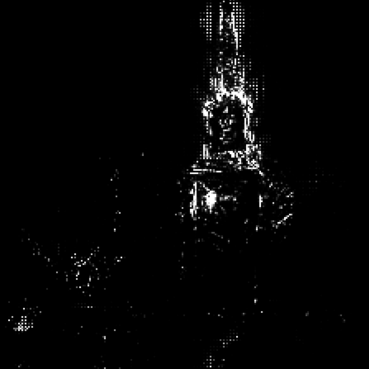
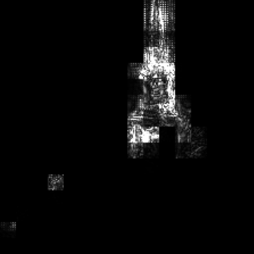
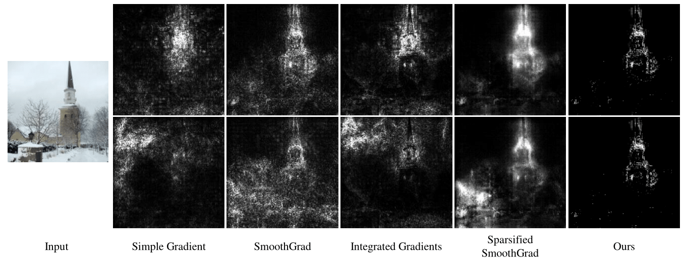
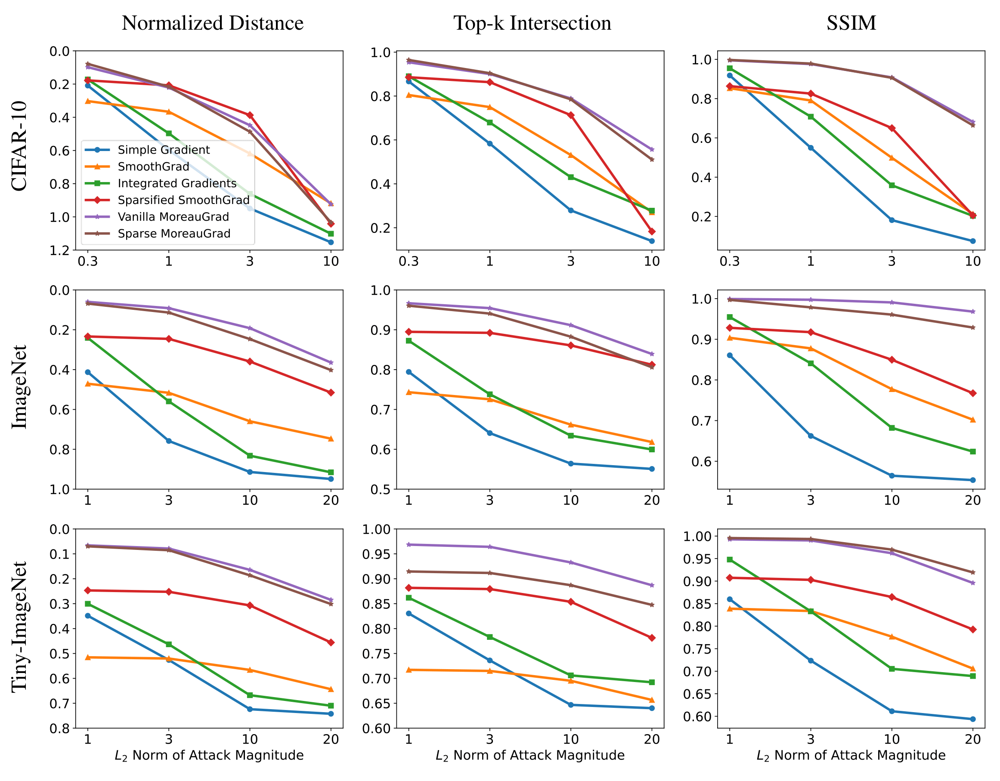

# MoreauGrad: Sparse and Robust Interpretation of Neural Networks via Moreau Envelope

This is the official implementation of paper "MoreauGrad: Sparse and Robust Interpretation of Neural Networks via Moreau Envelope".

## Applications
---
## Sparse Interpretation
Given an image and a neural network, our approach could let neural network explain how it make the decision.

Moreover, the interpretations are sparse (middle one) or group-sparse (right-most), revealing the most important pixels.
<p float="left">
  
   
   
</p>

## Robust Interpretation
Empircal experiments show that MoreauGrad is robust to adversarial interpretation attacks.



## Dependencies
---
The following is the least requirement to run MoreauGrad
- PyTorch, Torchvision with GPU support
- tqdm (Progess bar)

## Usage
---
The simpliest way to use MoreauGrad is:

```python
import explainer
from data_util import plot_saliency

def sparse_interpret(net, image, label):
    # Initialize explainer
    sparse_explainer = explainer.SparseMoreauExplainer(MAX_ITR=200)
    # Get sparse explaination
    interpretation = sparse_explainer.explain(net, image, label)
    # Visualization
    plot_saliency(interpretation.detach(), 'path/to/save/interpretation.png')
```
The function arguments are:
- net: PyTorch network
- image: an image tensor with shape in [1, 3, n, n]
- label: the label for the image

We recommend the reader to try **demo.py** to generate an interpretation of the church image first. Then, the reader may modify **interpret.py**, which is the script we provide for custom network and dataset interpretation.